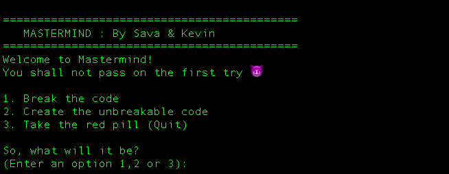
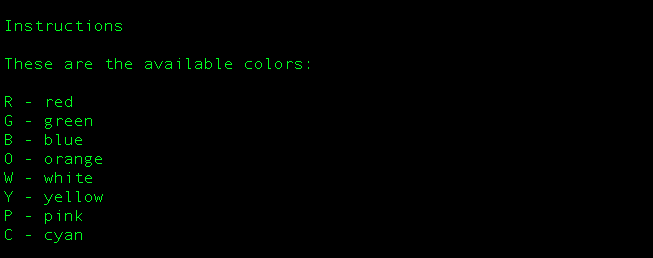
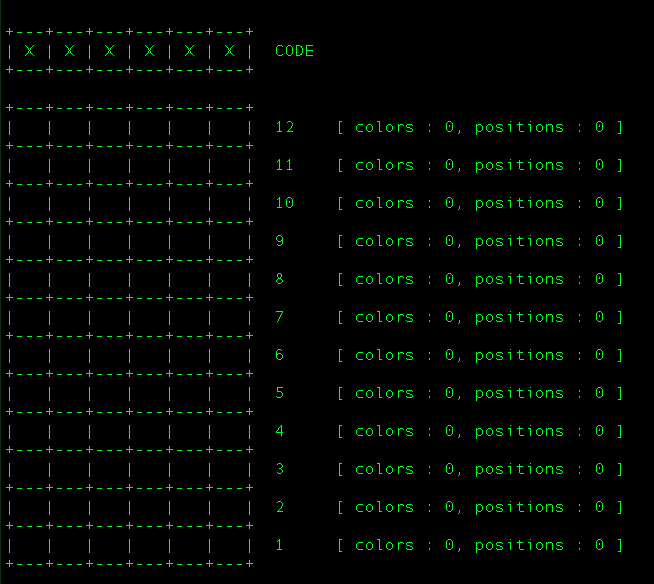
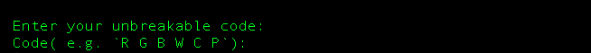

# Mastermind Game
This is an implementation of the Mastermind game in Ruby, as part of the final OOP project in TheOdinProject Intermediate course.

## Run the GAME

1. Make sure you have Ruby installed on your machine.
2. Check `ruby --version` for version 1.9 and above.
3. In the game folder, run the game with `ruby index.rb`

## Home Screen Menu
If all the steps above are completed, the home screen should be displayed as follows:

Select any of the three options to proceed.

## Guesser Mode

In order to play against the computer, select option 1.

This will display the instructions of how to interact with the game.

After that, a board is shown, with the current state of the game and a prompt to get input from the terminal.

## AI Mode

AI mode allows a player to set a code, and challenge the computer to break it.

## Useful Links
- [The Odin Project](https://www.theodinproject.com/courses/ruby-programming/lessons/oop)
- [Wikipedia description on the game](http://en.wikipedia.org/wiki/Mastermind_(board_game))
- [Console color implementation](https://stackoverflow.com/questions/1489183/colorized-ruby-output)
- [Colors definition](https://misc.flogisoft.com/bash/tip_colors_and_formatting)
- [Mastermind Game on the Browser](http://www.webgamesonline.com/mastermind/index.php)
- [Mastermind strategy #1](https://www.youtube.com/watch?v=XX5TlB6xT3M)
- [Mastermind strategy #2](https://www.youtube.com/watch?v=BTVt1OKp7v0)
